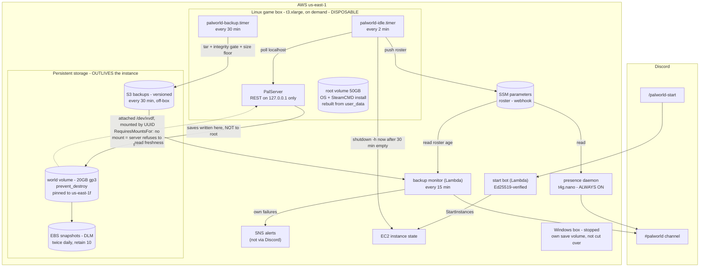

# palworld-server

Terraform for a self-hosted **Palworld 1.0** dedicated server on AWS, for a 5-10
player friend group. On-demand and cheap: the server **auto-stops when empty** and
is meant to be started on request, so you pay for compute only while people play.

- **Account:** `aidb-personal` profile → `414700437904`
- **Region:** `us-east-1`
- **Game instance:** `t3.xlarge` (4 vCPU / 16 GB — Pocketpair's recommended spec), ~$0.166/hr **only while running**
- **Baseline when both game boxes are stopped:** roughly **$22-23/mo**, and worth understanding
  rather than assuming — see [What it costs when nobody is playing](#what-it-costs-when-nobody-is-playing).

## Architecture

Three machines, one of which is always on.



**The control plane is one-way and outbound.** The REST API binds to `127.0.0.1` and the
security group opens neither 8212 (REST) nor 25575 (RCON) — only 8211/udp for the game and
22 from `admin_cidr`. The box **pushes** its player roster to an SSM parameter; the Discord
bot and the monitor read that parameter. Nothing external reaches into the box, and the
admin password never crosses the network. This was the outcome of a multi-model critique
that killed an earlier over-networked design (decision record in AIDB:
`_global/personal/palworld-server/2026-07-07-discord-ec2-control-plane-analysis.md`).

**Start and stop are deliberately asymmetric.**

| Direction | Mechanism |
|---|---|
| **Start** (Discord → on) | Whitelisted slash command → Lambda (Ed25519-verified) → `ec2:StartInstances`. |
| **Stop** (empty → off) | Entirely local. A systemd timer polls localhost every 2 min and runs `shutdown -h now` after `idle_shutdown_minutes` (30) of zero players; `instance_initiated_shutdown_behavior = "stop"` turns that into an EC2 stop, so compute billing halts. No external scheduler, no NAT. |
| **Presence** | Always-on `t4g.nano` holding the Discord Gateway socket, so the bot can show "sleeping" while the game box is off. Behind `enable_presence_bot`. |

**The idle watcher fails OPEN, on purpose.** Any error reaching or parsing the REST API
counts as "players present", so a transient blip can never stop a server people are on.
The cost of that choice is that a *broken* watcher never stops the box and never complains —
which is why its liveness is watched from off-box (below).

**Storage is shaped by the 2026-07-18 incident: the world is not on the box.**

EBS is network-attached storage that lives in the availability zone, not on the instance —
so the world volume (`world_volume.tf`, 20 GB gp3, encrypted) is a separate object that stays
put when the instance is stopped, replaced, or destroyed. It attaches at `/dev/xvdf` and is
mounted **by UUID** (never a device name, which can renumber) at `Pal/Saved/SaveGames`.

That separation is the actual fix. The instance-level guards — `prevent_destroy`,
`delete_on_termination = false`, `user_data_replace_on_change = false` — only reduce the
*chance* of a replacement, and each is one edit away from being removed by the same change
that destroys the box. Moving the data off the instance is what makes a replacement
**survivable** rather than merely unlikely: rebuild the box freely, the world does not care.

Three properties worth knowing:

- **`palworld.service` carries `RequiresMountsFor`**, so if the volume is not mounted the
  server refuses to start rather than starting and generating a fresh empty world on the root
  disk. That exact failure is how a restore once "succeeded" while serving nothing.
- **The volume is pinned to its AZ** (`us-east-1f`). Any rebuilt instance must launch there.
  Moving zones is a snapshot-and-restore, not a re-attach.
- **The root volume is disposable by design** — OS and SteamCMD install only, reproducible
  from `user_data`. It also carries `delete_on_termination = false` as a second line of
  defence, left over from when the world still lived on it.

Three independent copies protect the world: the volume itself, DLM snapshots twice daily
(retain 10), and the 30-minute S3 backups — the only genuinely off-box copy of the three.
See `AGENTS.md` for the full rules this produced.

**Two things watch the box, both from outside it.**

| Watchdog | What it catches |
|---|---|
| **Backup freshness** | Rolling 30-min backups to versioned S3, gated on integrity + a size floor. A capture whose force-save could not be *proven* goes to a `world/linux-degraded/` prefix and exits non-zero rather than being published as healthy. |
| **Idle-watcher liveness** | The same Lambda checks how long ago the roster parameter was written. Stale while the instance is running (past a boot grace) means the watcher is dead and the box is billing with nobody on it. Added after exactly that happened on 2026-07-19. |

Both alert to Discord. The monitor's **own** failures raise a CloudWatch alarm into SNS —
deliberately a channel that does not depend on Discord being the healthy thing, since a
broken webhook is one of the failures it exists to surface.

## What it costs when nobody is playing

Compute stops when the box does, but storage does not. Approximate, `us-east-1`:

| Item | Monthly |
|---|---|
| 198 GB gp3 across 5 volumes | ~$15.85 |
| Presence `t4g.nano` (always on) | ~$3.05 |
| Elastic IP | ~$3.65 |
| S3 backups (~870 MB, versioned) | ~$0.02 |
| Lambda / EventBridge / SNS | free tier |
| **Floor** | **~$22.60** |

The single biggest line is the **stopped Windows box**: its 100 GB root plus 20 GB save
volume bill ~$9.60/mo for a machine that is not yet in use. If the migration stalls, that is
the first thing to reclaim — snapshot and delete the root volume, keep the save volume.

## Deploy

```bash
cd terraform
cp terraform.tfvars.example terraform.tfvars   # then edit: admin_cidr, passwords
aws sso login --profile aidb-personal          # if the session is stale
terraform init
terraform plan
terraform apply
```

After apply, `terraform output` gives you the connect address, SSH command, and the
manual start/stop commands to use until the Discord bot exists.

## What players do

Connect in Palworld via **Join with IP** using the `connect_address` output
(`<elastic-ip>:8211`). The IP is stable (Elastic IP) so it never changes between sessions.

## Mods — Linux cannot run them; the Windows box can

Self-hosting is specifically so building mods work (managed hosts like GPORTAL block
them). **They do not load on the Linux dedicated server** — Palworld only supports
server-side mods on the Windows dedicated build, which is why `windows*.tf` exists.

Tested end-to-end on 2026-07-18 with "Less Restrictive Building" (Nexus mod 98), on the
Windows box, using the PAK variant (no UE4SS needed):

- The relaxed building is gated on **both sides**. A vanilla client on a modded server
  cannot place sky/no-collision builds, and a modded client on a vanilla server cannot
  either. So the server needs the `.pak` **and every player who wants to build needs it
  too** — a vanilla player can still join, see, and interact with modded structures.
- On the Windows box the `.pak`s live on the persistent `D:` volume
  (`D:\PalServer\mods`) and are copied into `Pal\Content\Paks\~mods` on every boot.
  They cannot be re-downloaded automatically: Nexus requires a login.

Expect mods to need updated builds right after any major Palworld patch — which is why
the Windows bootstrap deliberately does **not** run SteamCMD on every boot.

## Layout

```
terraform/           base server (Linux, live)
  compute.tf         EC2 instance, generated SSH keypair, root EBS, game settings
  world_volume.tf    the world's OWN EBS volume (prevent_destroy) + attachment
  network.tf         security group (8211/udp public, 22 admin-only), Elastic IP
  iam.tf             instance role (SSM Session Manager), DLM backup role
  backup.tf          daily EBS snapshots (retain 5) via Data Lifecycle Manager
  backups_s3.tf      versioned backup bucket + the S3-hosted bootstrap scripts
  backup_monitor.tf  off-box Lambda: backup freshness AND idle-watcher liveness
  discord.tf         start-on-request Lambda + Function URL + billing alarm
  presence.tf        always-on presence daemon (enable_presence_bot)
  ssm.tf             roster + webhook parameters (the box's one-way channel out)
  user_data.sh.tftpl cloud-init: world mount, SteamCMD, server config, both timers
  variables.tf outputs.tf data.tf providers.tf versions.tf

  windows.tf              Windows migration: SG, persistent save volume, DLM
  windows_instance.tf     the parallel Windows game instance
  windows_user_data.ps1.tftpl  its bootstrap (MUST STAY PURE ASCII - see header)
scripts/             fetched from S3 at boot, NOT embedded in user_data
  idle-shutdown.sh     the localhost player-count poller + roster publisher (Linux)
  backup-to-s3.sh      30-min rolling backup, integrity-gated (Linux)
  palworld-launch.ps1  Windows launcher + watchdog (Scheduled Task)
  palworld-idle.ps1    Windows idle-shutdown watcher
  backup-to-s3.ps1     Windows rolling backup
  restore-drill.ps1    proves a backup actually restores - run it before cutover
  compensation/        save-editing tools (Palworld Save Pal WS client)
discord-bot/
  src/               start-on-request bot (deployed)
  presence/          Gateway presence daemon
  backup-monitor/    the off-box watchdog Lambda
  tests/             red/green harness for the monitor (cd discord-bot && npm test)
reference/           item display-name -> internal-ID table (the names LIE; read the README)
```

Bootstrap scripts ship from S3 rather than being embedded in `user_data`: embedding them
blew EC2's hard 16 KB limit, and hosting them means a script fix no longer changes the
`user_data` hash — so deploying one cannot force a player-facing instance rebuild.

## Windows migration status

The Windows box is proven end-to-end but **not cut over** — Linux is still the live server.

The idle-shutdown gap is closed: `palworld-idle.ps1` now runs as a SYSTEM Scheduled Task
with a launcher watchdog, and its shutdown path force-saves and *verifies* `Level.sav`'s
mtime advanced before powering off, refusing to stop if it cannot prove the save reached
disk (fixed in `ba7df40` / `5ea41e3`). The PowerShell parse failure that caused the earlier
gap is why `windows_user_data.ps1.tftpl` must stay pure ASCII — check with
`grep -P '[^\x00-\x7F]'` before touching it.

Cutover still requires: a final save copy, repointing the start Lambda (`discord.tf`) and
the presence daemon (`presence.tf`) off the Linux instance id, moving the Elastic IP
(`network.tf`), and keeping Linux stopped ~1 week as rollback. Two things to remember when
it happens — the backup monitor watches `world/linux/` only, so its `BACKUP_PREFIX` needs
repointing or Windows backups go unwatched; and `var.idle_shutdown_minutes` renders into the
Windows `user_data`, which has `user_data_replace_on_change = true`, so changing it replaces
that instance.
